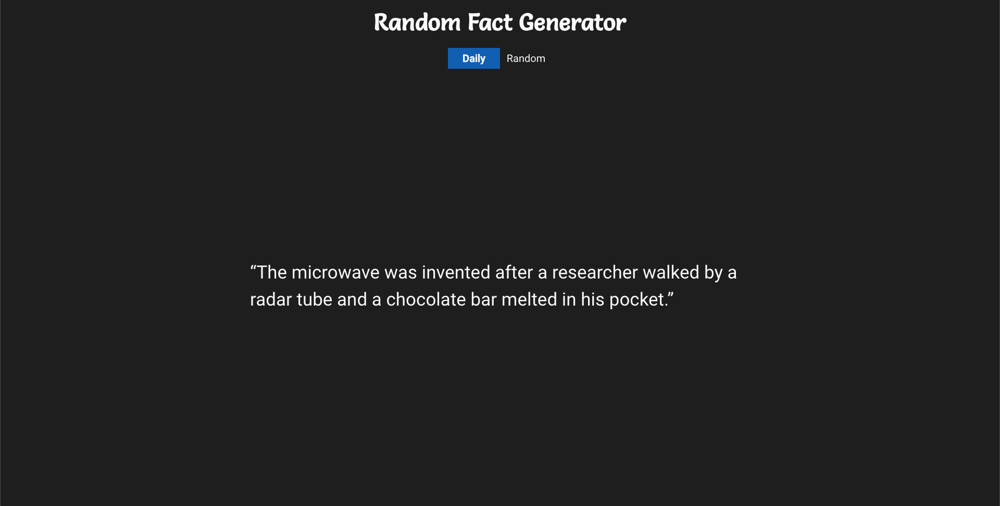

# Random Fact Generator

- [Overview](#overview)
- [Features](#features)
- [Requirements](#tech-stack)
- [Local Environment Setup](#local-environment-setup)
- [Support](#support)
- [License](#license)

## Overview
Application that generates random facts or gives you a daily fact.


[Link to demo.](https://rafage.netlify.app/)

## Features
- Get random facts
- Get daily fact

## Tech Stack
- HTML
- SCSS
- TypeScript
- Vite
- Vitest

## Local Environment Setup

1. ```git clone https://github.com/algorodev/Random-Fact-Generator.git```
2. ```yarn install```
3. ```yarn run dev```
4. Open in your default browser this [URL](http://localhost:5173/)

## Support
- [PORTFOLIO](https://portfolio-algorodev.netlify.app/)
- [LINKEDIN](https://www.linkedin.com/in/algorodev/)
- [TWITTER](https://twitter.com/algorodev)

## License
This project is licensed under the **MIT license**.

See [LICENSE](LICENSE) for more information.
